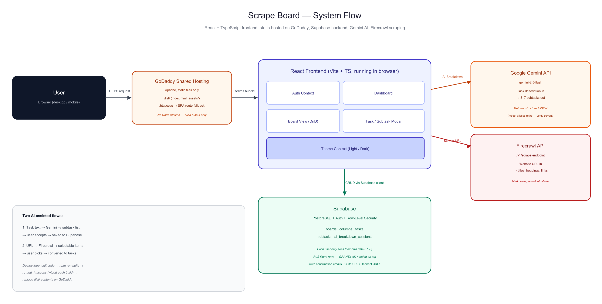

# Scrape Board

A full-stack project management tool that combines a drag-and-drop Kanban board with two AI/automation-driven workflows: **AI task breakdown** (Google Gemini) and **website-to-task conversion** (Firecrawl). Built solo, end-to-end — schema design, auth, UI, both external API integrations, and a live deployment to shared hosting outside the usual Vercel/Netlify path.

Live at `webscraper.ensconce.in`, branded in-app as **Scrape Board — AI-Powered Web Content Analyzer & Management Tool**.

## Context / Problem

Most lightweight project trackers require every task to be typed out manually, and turning research or reference material (a spec page, an article, a competitor site) into actionable to-dos is manual, repetitive work. I wanted to test whether two different AI/automation capabilities — generative breakdown and structured web extraction — could be embedded directly into a task manager's core workflow rather than bolted on as a separate tool.

## Objective

Build a working, secured, multi-user project management app that:
1. Lets a user manage boards/tasks with a standard Kanban flow
2. Uses an LLM to turn a single task description into a structured, actionable subtask list
3. Uses a scraping API to pull structured content from any URL and let the user selectively convert it into tasks
4. Enforces per-user data isolation properly (not just at the UI layer)

## Approach

**Data model first.** Before writing UI, I designed the schema around five entities — `boards`, `columns`, `tasks`, `subtasks`, `ai_breakdown_sessions` — with Row-Level Security enabled on every table in Supabase/Postgres, so access control lives in the database, not just in frontend logic.

**Two independent AI/automation paths, one integration pattern.** Rather than treating "AI breakdown" and "scraping" as unrelated features, I built both services (`services/ai.ts`, `services/firecrawl.ts`) around the same contract: take unstructured input, call an external API, return strictly-typed structured output, and fail loudly with a specific, user-readable error if the API key is missing or the response is malformed. This meant the UI layer never has to guess what shape it's getting back.

**Trade-off — client-side API calls vs. a backend proxy.** For this build, the Gemini and Firecrawl calls are made directly from the client with the API key in an environment variable. That was the right call for shipping quickly and keeping the architecture simple end-to-end, but it isn't how I'd ship this to real users — production would need a thin backend/edge function to hold the keys server-side. I'd treat that as the first item in a "harden for production" pass.

**Prompt design for structured output.** The Gemini prompt explicitly constrains the model to return raw JSON only (no markdown fencing, no prose), which I still defensively strip and validate before use — because "the model usually follows instructions" isn't a contract you can build a UI on.

## What It Does

- **Auth & Boards:** Email/password auth (Supabase Auth); users create and manage multiple project boards
- **Kanban Board:** Drag-and-drop tasks across To-Do / In Progress / Done (`@dnd-kit`), with subtasks and due dates
- **AI Task Breakdown:** User writes a task description → Gemini returns 3–7 actionable subtasks as structured JSON → user reviews and accepts or regenerates
- **Website Scraper → Tasks:** User pastes a URL → Firecrawl extracts titles, headings, and links → results shown as selectable items → chosen items get converted into tasks on a chosen board
- **Theming:** Persisted light/dark mode with an animated background
- **Security:** Row-Level Security on every table; every query is scoped to the authenticated user

## Architecture / Flow



The frontend is the single orchestration point: it talks to Supabase for all persistent data (boards/tasks/auth) and calls out to Gemini and Firecrawl independently for the two AI-assisted flows. Both external calls return typed, validated data before anything touches app state.

## Third-Party Services & Accounts Required

This app has no backend of its own — it's a static frontend that talks directly to three external services. Getting it running from scratch (or re-pointing it at a fresh environment) means setting up accounts for all three:

**1. Supabase (database, auth)**
- Create a free account at [supabase.com](https://supabase.com) and start a new project.
- At project-creation time, under **Security**, leave **Enable Data API** checked (required — it's what turns your tables into the REST API `supabase-js` calls) and leave **Automatically expose new tables** unchecked (Supabase's recommended default; this project's RLS policies handle access control explicitly instead).
- Apply the schema: open **SQL Editor → New query**, paste the full contents of [`codebase/supabase/migrations/20251208093543_create_project_management_schema.sql`](codebase/supabase/migrations/20251208093543_create_project_management_schema.sql), and run it. This creates the five tables (`boards`, `columns`, `tasks`, `subtasks`, `ai_breakdown_sessions`) with RLS enabled and per-user policies.
- **Important gotcha:** leaving "Automatically expose new tables" unchecked also means the `authenticated` role isn't auto-granted table privileges — RLS policies alone don't grant access, they only filter it after access is already permitted. Without this, every query returns `403 Forbidden`. Run this once, after the schema, in the SQL Editor:
  ```sql
  GRANT USAGE ON SCHEMA public TO authenticated;
  GRANT SELECT, INSERT, UPDATE, DELETE ON boards TO authenticated;
  GRANT SELECT, INSERT, UPDATE, DELETE ON columns TO authenticated;
  GRANT SELECT, INSERT, UPDATE, DELETE ON tasks TO authenticated;
  GRANT SELECT, INSERT, UPDATE, DELETE ON subtasks TO authenticated;
  GRANT SELECT, INSERT, UPDATE, DELETE ON ai_breakdown_sessions TO authenticated;
  ```
- Under **Authentication → URL Configuration**, set **Site URL** to your deployed domain (not `localhost:3000`, which is the default) and add it to **Redirect URLs** — otherwise email confirmation links sent after signup point at a dead localhost address.
- Grab the project's **URL** and **anon key** from **Settings → API** for the `.env` file below.

**2. Firecrawl (website scraping)**
- Sign up at [firecrawl.dev](https://firecrawl.dev) (free tier available) and generate an API key.
- The app calls Firecrawl's current `/v1/scrape` endpoint — if you're referencing older tutorials or forked code that still points at `/v0/scrape`, that endpoint is deprecated and returns a 500.

**3. Google Gemini (AI task breakdown)**
- Get a free API key at [aistudio.google.com/apikey](https://aistudio.google.com/apikey) (sign in with a Google account).
- The app targets `gemini-2.5-flash`. Google retires model aliases periodically (`gemini-pro` and `gemini-2.0-flash` were both retired during this project's build) — if AI breakdown starts failing with a "model no longer available" error, check [Google's model list](https://ai.google.dev/gemini-api/docs/models) for the current recommended flash model and update `src/services/ai.ts`.

**Environment file** (`codebase/.env`, never committed):
```env
VITE_SUPABASE_URL=https://your-project-ref.supabase.co
VITE_SUPABASE_ANON_KEY=your-anon-key
VITE_FIRECRAWL_API_KEY=your-firecrawl-key
VITE_GEMINI_API_KEY=your-gemini-key
```
Vite bakes these into the static JS bundle at build time — so the `.env` file must exist *before* running `npm run build`, and any key change requires a rebuild (editing `.env` alone doesn't touch an already-built `dist/`).

## Deployment (GoDaddy shared hosting)

The other portfolio angle of this project: shipping a Vite/React SPA to **shared hosting with no Node runtime** — not Vercel/Netlify, which are built for this. The key realization driving the whole approach: React with Vite is a *build tool*, not a server-side runtime. `npm run build` compiles all `.tsx`/`.ts` source into plain static `index.html`, `.css`, and `.js` files in `dist/`. Nothing "runs" on the host — it's the same kind of static file serving as any plain HTML site, and `supabase-js` talks to Supabase directly from the visitor's browser over HTTPS regardless of what serves the files.

Steps actually used to deploy to a subdomain (`webscraper.ensconce.in`) on an existing GoDaddy shared-hosting account (cPanel-style):

1. **Build locally.** With `.env` populated (see above), run `npm install` once, then `npm run build`. Produces `dist/index.html` + `dist/assets/*`.
2. **Create the subdomain.** In GoDaddy's domain management, add a new domain/subdomain (`webscraper.ensconce.in`), with its own **Document Root** (e.g. `public_html/webscraper.ensconce.in`) — critically, leave **"Share document root"** unchecked. Checking it makes the subdomain permanently alias the main site's files instead of serving its own.
3. **Upload only the contents of `dist/`** (not the `dist/` folder itself, not `src/`, `node_modules/`, `package.json`, or `.env`) into that document-root folder via GoDaddy's File Manager.
4. **Add SPA routing fallback.** Because the app uses `react-router-dom` (client-side routing), a direct visit or refresh on a non-root URL (e.g. `/board/123`) 404s on Apache unless requests fall back to `index.html`. An `.htaccess` file in the same folder as `index.html` handles this:
   ```apache
   RewriteEngine On
   RewriteBase /
   RewriteCond %{REQUEST_FILENAME} !-f
   RewriteCond %{REQUEST_FILENAME} !-d
   RewriteRule . /index.html [L]
   ```
   `.htaccess` files are dot-prefixed and often hidden by default in file managers — enable "Show Hidden Files" so it actually uploads.
5. **Rebuild + re-upload on every env/code change.** Vite fingerprints output filenames per build (`index-BPi2Siw3.js`, etc.), and the build step wipes `dist/` clean each time — including the `.htaccess`, which has to be re-added after every rebuild. Each time an API key was added or a bug fixed during this project, the cycle was: edit → `npm run build` → re-add `.htaccess` → delete old files in the GoDaddy folder → upload the new `dist/` contents.

## Bugs Found & Fixed Post-Deployment

Testing against the live deployment (not just `npm run dev`) surfaced issues that hadn't shown up locally:

- **Stale task modal data:** the task edit modal kept its own internal form state that wasn't reset when switching between tasks, so opening a different task could show the previous task's title/description until you started typing. Fixed by keying/resetting the modal's state on task change.
- **Ghost "New Task" rows:** clicking "Add Task" inserted a row into Supabase immediately, before the user typed anything — so closing the modal via the X button without saving still left a stray empty task behind. Fixed by deleting the just-created row if the modal is dismissed without a save.
- **Empty Kanban columns weren't valid drop targets:** `@dnd-kit` only registered drop zones on existing task cards, so a column with zero tasks couldn't receive a dragged task at all. Fixed by giving each column its own droppable container independent of whether it holds any cards.
- **Dark mode toggle had no visual effect:** `tailwind.config.js` was missing `darkMode: 'class'`, so Tailwind defaulted to following the OS-level `prefers-color-scheme` media query and ignored the `dark`/`light` class the app was toggling on `<html>`. One-line config fix.

## Sample Data

The `ai_breakdown_sessions` table stores exactly what was sent to and received from Gemini on every breakdown, which doubles as a debug trail. Illustrative shape of a record (not a captured example — actual output varies per run):

```json
{
  "input_text": "Set up CI/CD pipeline for the staging environment",
  "output_json": {
    "subtasks": [
      "Choose CI/CD provider and connect the repository",
      "Define build and test stages in the pipeline config",
      "Configure staging environment secrets and variables"
    ]
  }
}
```

The scraper's `ScrapedItem` type shows the structured shape pulled out of raw scraped markdown before it's shown to the user for selection — see `src/types/database.ts` and `src/services/firecrawl.ts` in `codebase/`.

## Results / Learnings

- Enforcing RLS at the database layer (rather than trusting frontend query filters) meant the multi-user isolation held up even when I intentionally tried to query other users' data from the browser console
- The single biggest reliability risk wasn't the UI — it was LLM output not matching the expected JSON shape. Defensive parsing/validation on every AI response turned out to matter more than prompt engineering
- RLS policies and table-level GRANTs are two separate layers in Supabase — disabling "auto-expose new tables" (the secure default) silently blocks all API access until you grant privileges explicitly. RLS filters *which rows* you can see; grants control *whether you're allowed in the table at all*
- Deploying a Vite/React SPA to shared hosting (no Node runtime, no Vercel/Netlify-style platform) is straightforward once you internalize that the build step already produces plain static files — the friction is entirely operational (re-adding `.htaccess` after every rebuild wipes `dist/`, Supabase's auth redirect URLs defaulting to `localhost`, model/endpoint versions drifting out from under a codebase between build and deploy)
- If I extended this: move both API keys behind a backend/edge function, add retry/backoff on the AI calls, cache scrape results so re-visiting the same URL doesn't re-hit the API, and automate the GoDaddy upload step (currently manual via File Manager) with an FTP/SFTP deploy script

## Tech Stack

| Layer | Technology |
|---|---|
| Frontend | React 18, TypeScript, Vite |
| Styling | Tailwind CSS, shadcn/ui |
| Backend / DB | Supabase (PostgreSQL, Auth, Row-Level Security) |
| Drag & Drop | @dnd-kit |
| AI | Google Gemini API (`gemini-2.5-flash`) |
| Scraping | Firecrawl API (`/v1/scrape`) |
| Routing | React Router v7 |
| Hosting | GoDaddy shared hosting (static files, Apache `.htaccess` for SPA routing) |

## How to Run It

Full setup instructions (accounts, env vars, DB schema, API keys, GoDaddy deployment) are in the [Third-Party Services & Accounts Required](#third-party-services--accounts-required) and [Deployment](#deployment-godaddy-shared-hosting) sections above, and in [`codebase/README.md`](codebase/README.md). Quick version, for local dev:

```bash
cd codebase
npm install
# create .env with VITE_SUPABASE_URL, VITE_SUPABASE_ANON_KEY,
# VITE_GEMINI_API_KEY, and VITE_FIRECRAWL_API_KEY
npm run dev
```

To produce a deployable static build instead: `npm run build`, then upload the contents of `dist/` (plus an `.htaccess` for SPA routing) to any static host.
