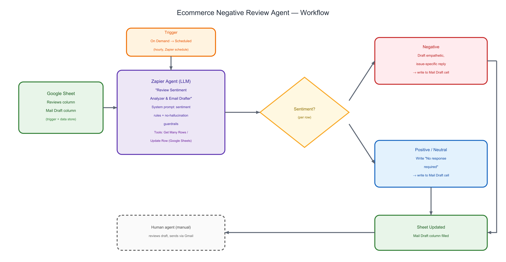

# Ecommerce Negative Review Agent

**A no-code Zapier AI agent that reads customer reviews from a Google Sheet, classifies sentiment, and drafts an empathetic reply only for the reviews that actually need one.**

## Context / Problem

E-commerce support teams have to read every incoming review to decide whether it needs a response. Not every review does — but missing a negative one that does can quietly damage customer trust and brand reputation. Doing this triage manually doesn't scale as review volume grows, and a slow or generic reply to a frustrated customer can be almost as costly as no reply at all.

## Objective

Build an agent — using Zapier's no-code Agent builder rather than a custom-coded pipeline — that mimics a human support agent's judgment: read each new review, decide if it's negative enough to warrant a response, and if so draft a specific, empathetic reply. The goal was decision-making at scale, not blanket automation: positive and neutral reviews should be left alone.

## Approach

- **Platform choice:** Built on Zapier Agents (LLM-backed, no-code) instead of a custom-coded pipeline (e.g., a script calling an LLM API directly). Trade-off: no-code meant a faster build and nothing to host or maintain, but less control over the underlying model and no automated test suite — logic changes go through prompt edits rather than version-controlled code.
- **Classification approach:** Considered a rule-based / keyword sentiment classifier — fast and deterministic, but brittle, and it can't draft a real reply on its own. Chose an LLM-driven system prompt instead, which handles classification and drafting in a single step, at the cost of needing explicit guardrails to keep it from inventing content.
- **Guardrails, iterated:** The system prompt evolved through testing. An earlier rule ("do not rewrite, summarize, or paraphrase the review") was replaced with a stronger, broader constraint — "do not hallucinate details, customers, actions, or reviews" — after testing showed the narrower rule wasn't enough to keep the agent from adding invented specifics.
- **Trigger:** Started on **On Demand** while testing (Zapier's recommended pattern for a new agent), then moved to an **hourly schedule** once the agent was verified to behave correctly.
- **Scope cut — no auto-send:** The agent only *drafts* into the sheet; it doesn't send email itself. A Gmail account is listed as a prerequisite, but no Gmail tool is wired into the agent — only two Google Sheets tools are connected. A human reviews and sends the draft. This was a deliberate choice to keep a person in the loop on outgoing customer communication.

## What It Does

1. Reads all rows from a connected Google Sheet with a `Review` column and a `Mail Draft` column (via the "Get Many Spreadsheet Rows (Advanced)" tool).
2. Treats any row with an empty `Mail Draft` cell as new / unprocessed — already-answered rows are left untouched.
3. Analyzes the review's sentiment directly from the text, with no separate classification step.
4. If the review is negative, drafts a professional, empathetic email that acknowledges the *specific* issue raised — not a generic template.
5. If the review is positive or neutral, writes the exact phrase `No response required` instead.
6. Writes the result back into the `Mail Draft` cell for that row (via "Update Spreadsheet Row(s)").
7. Because it only acts on empty cells, it's safe to re-run on a schedule without duplicating or overwriting existing replies.

## Architecture / Flow

## Sample Data

A real review-and-reply pair from the connected sheet:

> **Review:** "The product arrived damaged and is not working properly. Very disappointed with the poor quality and broken packaging. This is the worst experience I have had so far."

> **Agent-drafted reply:** "Dear Valued Customer, We sincerely apologize for the disappointing experience you had with your recent purchase. It is completely unacceptable that your product arrived damaged with broken packaging and is not functioning properly. We take full responsibility for this quality control failure and understand your frustration. We would like to make this right immediately by offering you a full replacement at no cost, along with expedited shipping to ensure it reaches you quickly and in perfect condition. Please reply to this email with your order details, and we will process your replacement right away. Additionally, we will investigate this issue with our packaging and quality control teams to prevent similar problems in the future. Thank you for bringing this to our attention, and we appreciate your patience as we work to resolve this matter. Best regards, Customer Service Team"

For a positive review ("Absolutely loved the product. The build quality is solid and it works perfectly...") the agent correctly wrote `No response required` instead of drafting anything.

## Results / Learnings

- Across the rows already processed in this sheet snapshot (2 negative, 4 positive/neutral), the agent matched sentiment to the correct action every time: negative reviews got tailored replies, positive/neutral reviews got `No response required`.
- The sheet also contains a 3rd negative review ("...later on it stopped working, I am looking to have refund...") whose `Mail Draft` cell is still empty at the time of this snapshot — a real example of a row queued for the next scheduled run, which is exactly the intended idempotent behavior: the agent only acts on empty cells, never re-answers a processed row.
- Prompt-only guardrails took real iteration to get right. The first version's anti-hallucination rule was too narrow; testing surfaced the need for the broader "do not hallucinate details, customers, actions, or reviews" rule in the final prompt.
- No-code trade-off: this build proves the concept fast and is easy to hand off to a non-engineer, but there's no automated test suite — verifying correctness means running Zapier's "Test agent" and manually checking rows like the ones above.
- Next step if this went further: wire in the Gmail send step (with a manual-approval gate) so the human-in-the-loop review happens right before send, not as a separate manual copy-paste step.

## Tech Stack

| Component | Role |
|---|---|
| Zapier Agents (beta) | LLM-backed no-code agent runtime; hosts the system prompt and orchestrates tool calls |
| Google Sheets | Data source (reviews) and destination (drafted replies), connected via Zapier's "Get Many Spreadsheet Rows (Advanced)" and "Update Spreadsheet Row(s)" actions |
| Gmail | Prerequisite for the human step of sending the drafted reply — not wired into the agent itself |
| Zapier Scheduler | Runs the agent hourly in production; tested first with an On Demand trigger |

## How to Run It

This is a no-code Zapier Agent, so "running it" means recreating the configuration rather than executing code:

1. Create a Google Sheet with `Review` and `Mail Draft` columns — see `codebase/sample-reviews-and-drafts.xlsx` for the format and example data.
2. In [Zapier Agents](https://agents.zapier.com), create a new agent from scratch and set the trigger to **On Demand**.
3. Connect the two Google Sheets tools: **Get Many Spreadsheet Rows (Advanced)** and **Update Spreadsheet Row(s)**.
4. Paste in the system prompt from `codebase/system-prompt.md`.
5. Run "Test agent" to verify behavior, then switch the trigger to **Schedule by Zapier** and publish.

Full config reference: `codebase/workflow-config.md`. A real test-run transcript is in `codebase/test-run-log.md`.
