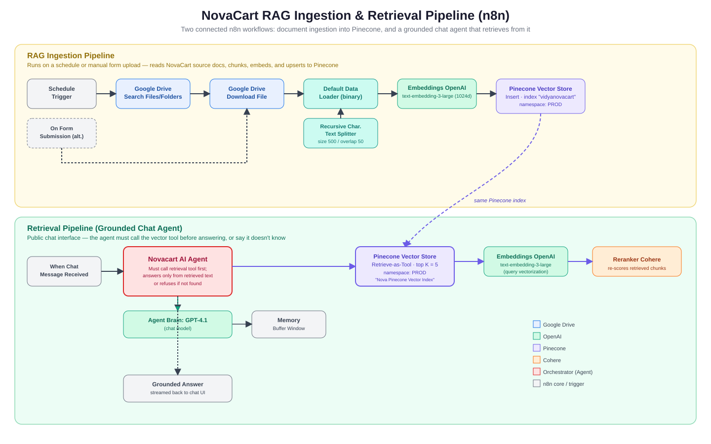

# NovaCart Grounded Metrics Agent (n8n RAG Pipeline)

A retrieval-augmented generation (RAG) system, built entirely in n8n, that lets NovaCart leadership ask plain-language questions about company metrics and get answers grounded strictly in internal documents — with a hard refusal instead of a hallucinated guess when the data isn't there.

## Context / Problem

NovaCart's leadership team reviews weekly operational metrics — revenue, conversion, churn, SLA compliance — but the source data lives scattered across Drive documents (annual report, SKU-level sales workbook, product catalog). Pulling these together for a weekly review is manual and slow, and generic ChatGPT-style tools will confidently invent numbers when they don't actually have NovaCart's internal data. The brief was to replace that manual process with an automated agent that answers *only* from verified internal sources, and to demonstrate concretely why RAG beats a prompt-only LLM for this kind of enterprise reporting.

## Objective

Build a two-part n8n workflow that:
1. Ingests NovaCart's source documents from Google Drive, chunks and embeds them, and stores them in a vector index.
2. Serves a chat interface where an AI agent must retrieve from that index before answering, and explicitly declines rather than guesses when a question falls outside the indexed data.

## Approach

The workflow is split into two independently triggerable n8n pipelines that share one Pinecone index:

- **Ingestion pipeline** — a `Schedule Trigger` (for recurring refresh) or a `Form Trigger` (for ad-hoc manual uploads) feeds a Google Drive search/download step, a recursive character text splitter (500 chars, 50 overlap), and an OpenAI `text-embedding-3-large` embedder, landing in a Pinecone index (`vidyanovacart`, namespace `PROD`).
- **Retrieval pipeline** — a public Chat Trigger feeds a GPT-4.1 agent that is *instructed* (not just allowed) to call the Pinecone retrieval tool exactly once per question, read the result, and either answer strictly from retrieved text or return a fixed refusal line if nothing relevant comes back. A Cohere reranker sits between Pinecone and the agent to re-score the top candidates before they reach the model.

**Key trade-off:** the system prompt intentionally sacrifices some conversational flexibility for auditability. Rather than letting the model answer from its own general knowledge when retrieval comes back thin, the agent is forced into a strict "retrieve-then-answer-or-refuse" loop with an exact refusal string. That's a worse experience for edge-case questions the documents don't cover, but for a leadership-facing metrics tool, a predictable "I don't have that" beats a plausible-sounding wrong number — which was the whole point of choosing RAG over a prompt-only approach in the first place. The one deliberate exception is competitor/product comparisons, where the agent is explicitly allowed to fall back to a built-in web search tool rather than refuse.

## What It Does

- Watches (or is manually fed via a form) a Google Drive folder of NovaCart source documents and keeps a Pinecone vector index in sync with them.
- Serves a branded public chat (custom CSS theme, streaming responses) backed by GPT-4.1.
- Forces the agent to search the vector index before answering any substantive question, using a 5-item top-K retrieval reranked by Cohere.
- Refuses with a fixed, exact message when the retrieved context doesn't cover the question, instead of improvising.
- Keeps short-term conversation context via an n8n buffer-window memory so follow-up questions stay coherent.
- Can hand off to web search specifically for external/competitor comparisons.

## Architecture

Two n8n pipelines share the same Pinecone index: an ingestion pipeline that keeps the index fresh from Google Drive, and a retrieval pipeline that answers chat questions from that index only. See `docs/diagram.svg` for the full node-level flow.

## Sample Data

This is a real response captured from an actual executed run of the published chat agent (see `docs/Screenshots.pdf`, page 8), not an invented example:

> **Q:** *"Share the Revenue figures comparison and how NovaPhone X1 performance... what are the lagging product lines? Please explain."*
>
> **A:** NovaPhone X1 generated the highest revenue at USD 1.62 billion, with about 1.9 million units sold and an average selling price of USD 852. This represents 57% of NovaCart's total revenue, making it the primary revenue driver.
>
> Other product lines: Smart Home Devices — USD 486 million (17% of revenue); Wearables — USD 398 million (14% of revenue); Subscription Services — USD 336 million (12% of revenue).
>
> Lagging product lines are Wearables and Subscription Services, each contributing far less to total revenue compared to NovaPhone X1.

Source documents indexed for this run: `NovaCart Company Annual Report 2024.docx`, `NovaCart_Product_Catalog.pdf`, and `SKU_Weekly_Sales_Conversion_3Y_with_Revenue.docx` (see `docs/Input-Files.zip`).

## Results / Learnings

- The screenshots in `docs/Screenshots.pdf` show a full, real execution: ingestion running node-by-node (Drive search → download → split → embed → Pinecone insert), followed by three separate chat prompts each producing grounded, cited-in-substance answers pulled from the indexed documents.
- Forcing exactly one tool call before any answer, plus an exact refusal string, is a cheap and effective way to make an LLM's "I don't know" behavior predictable and testable — a large part of what makes this trustworthy for leadership use versus a bare prompt-only chatbot.
- The public, unauthenticated chat trigger used here is fine for a demo but is explicitly called out in the solution guide as something to put behind auth before any real internal rollout.
- If extending this, the natural next step is widening ingestion beyond Drive (Notion/Confluence were named in the original problem statement but not built here) and adding citation metadata directly into the agent's final answer, not just its retrieval context.
- Live demo endpoint (may no longer be published/active): `https://ensmedia.app.n8n.cloud/webhook/e8826d4e-c042-44e7-80d1-017a3258de19/chat`

## Tech Stack

| Layer | Technology | Detail (verified from the workflow JSON) |
|---|---|---|
| Orchestration | n8n | Two linked workflows in one canvas (`02-RAG-NovacartRAGIngestionANDRetrievalPipelines.json`) |
| Source storage | Google Drive | OAuth2, `Search files and folders` + `Download file` nodes |
| Ingestion trigger | n8n Schedule Trigger / Form Trigger | Schedule for recurring sync; form for manual ad-hoc upload |
| Chunking | LangChain Recursive Character Text Splitter (via n8n) | Chunk size 500, overlap 50 |
| Embeddings | OpenAI `text-embedding-3-large` | 1024 dimensions (used identically at ingest and query time) |
| Vector database | Pinecone | Index `vidyanovacart`, namespace `PROD`, retrieval top-K = 5 |
| Reranker | Cohere (`Reranker Cohere` node) | Re-scores retrieved chunks before they reach the agent |
| Agent / LLM | OpenAI `gpt-4.1` | via `@n8n/n8n-nodes-langchain.agent` + `lmChatOpenAi` |
| Memory | n8n Buffer Window Memory | Session-scoped short-term chat context |
| Chat surface | n8n Chat Trigger | Public webhook, custom CSS theme, streaming enabled |

## How to Run It

1. Import `codebase/02-RAG-NovacartRAGIngestionANDRetrievalPipelines.json` into an n8n instance (self-hosted or n8n Cloud).
2. Create/attach credentials for Google Drive (OAuth2), OpenAI, Pinecone, and Cohere.
3. Create a Pinecone index named `vidyanovacart` (or update the node) with 1024 dimensions / cosine metric, and a `PROD` namespace.
4. Point the Google Drive nodes at your own source folder, then run the ingestion pipeline once (via the Schedule Trigger or the upload form) to populate the index.
5. Activate the workflow and open the Chat Trigger's public URL to start asking grounded questions.

Reference materials from the original build (problem statement, step-by-step solution guide, and execution screenshots) are in `docs/` for context.
