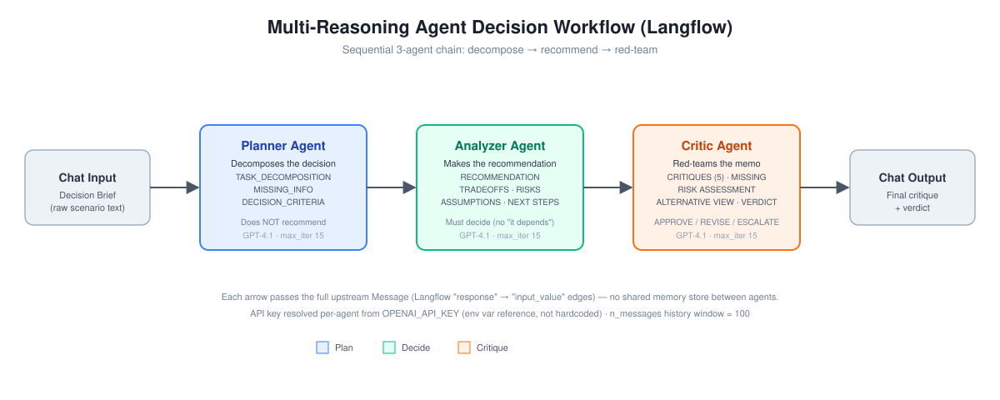

# Multi-Reasoning Agent Decision Workflow (Langflow)

A 3-agent decision pipeline — **Planner &rarr; Analyzer &rarr; Critic** — built as a visual flow in [Langflow](https://www.langflow.org/), that turns a raw business decision scenario into a structured, self-critiqued Decision Memo.

## Problem

A single LLM prompt asked to "recommend a decision" tends to skip steps: it jumps straight to a recommendation without decomposing the problem, doesn't separate planning from deciding, and never argues against its own output. That makes it easy for a PM or reviewer to over-trust a plausible-sounding memo that hasn't actually been stress-tested.

## Objective

Split the reasoning into three distinct, single-purpose agents so each step is auditable on its own:

1. **Planner** — decomposes the decision into evaluation tasks, missing information, and decision criteria, without recommending anything.
2. **Analyzer** — takes the brief plus the Planner's output and commits to an explicit recommendation with trade-offs, risks, and next steps.
3. **Critic** — red-teams the Analyzer's memo: critiques it, surfaces what's missing, assesses worst-case risk, argues the opposing view, and issues a verdict (APPROVE / REVISE / ESCALATE).

## Approach & Trade-offs

- **Sequential chain over one mega-prompt.** Each agent only sees what the role needs (the Planner never sees the Critic's rubric; the Critic never sees the raw brief directly, only the Analyzer's memo). This keeps each agent's output honest to its role, at the cost of 3 LLM calls instead of 1 — more latency and token spend for more rigor.
- **No shared memory/state component.** Langflow's `response &rarr; input_value` message-passing edges carry the full upstream output forward; there's no vector store or shared context object. Simple to reason about, but it means each agent only has what was explicitly passed to it (Planner output isn't visible to the Critic, for example).
- **Same model across all three agents (GPT-4.1)** rather than mixing model tiers per role, prioritizing consistent behavior over cost optimization for this demo.
- **`max_iterations = 15`** on every agent as a hard safety cap on tool-calling loops, per Langflow's `ModelCallLimitMiddleware` — an agent that starts looping can't run away indefinitely.
- **This is a focused 3-agent slice**, not the full reasoning pipeline. A broader prompt library (`docs/Alternate-Agent Instructions Library.pdf`) sketches a 12-step version of this same idea — Planner &rarr; Researcher &rarr; dual-lens Analyzers (Customer/Revenue vs. Risk) &rarr; Synthesis &rarr; Critic &rarr; Reviser &rarr; Confidence Scorer &rarr; Publisher &rarr; Notion export. This flow implements the core 3-agent spine of that design as a working, testable Langflow graph rather than the full pipeline.

## What It Does

1. A raw decision scenario is entered as **Chat Input** (e.g., "We're considering launching a Premium Subscription Tier...").
2. **Planner Agent** returns exactly three sections: `TASK_DECOMPOSITION` (5–8 bullets), `MISSING_INFO`, `DECISION_CRITERIA`. It's explicitly instructed not to recommend anything yet.
3. **Analyzer Agent** receives the original brief plus the Planner's output and must commit to a recommendation — the instructions state "You MUST decision (no 'it depends')." It returns `RECOMMENDATION`, `OPTIONS CONSIDERED`, `TRADEOFFS`, `RISKS AND MITIGATIONS`, `ASSUMPTIONS`, and `NEXT STEPS`.
4. **Critic Agent** receives only the Analyzer's memo and is instructed to "assume the memo has flaws until proven otherwise." It returns `CRITIQUES` (exactly 5), `MISSING CONSIDERATIONS`, `RISK ASSESSMENT`, `ALTERNATIVE VIEW`, and a final `VERDICT` of APPROVE, REVISE, or ESCALATE with a reason.
5. The Critic's output streams back through **Chat Output** as the final artifact.

## Architecture



```
Chat Input  →  Planner Agent  →  Analyzer Agent  →  Critic Agent  →  Chat Output
 (raw brief)   (decompose)       (recommend)         (red-team)       (verdict)
```

Each arrow is a Langflow `response → input_value` edge carrying a `Message` object — the Planner's full text output becomes the Analyzer's `input_value`, and so on down the chain. All three agents use the same `Agent` component (OpenAI `gpt-4.1`, tool-calling enabled), differing only in their `system_prompt`. The API key is resolved from the `OPENAI_API_KEY` environment variable via Langflow's `load_from_db` secret handling — it is not hardcoded in the flow file.

## Sample Data

Test inputs came from a set of four pre-written decision scenarios for a fictional company, "NovaCart" (`codebase/Prompts-Decision Briefs.pdf`), generated with a companion "Decision Brief Generator" prompt (Senior Product Strategy Advisor role, rule: no invented data, mark unknowns "TBD"):

- **Premium Subscription Tier** — launch a paid tier targeting +15% CLV
- **AI Recommendation Engine** — checkout-page recommender targeting +12% AOV
- **Platform Migration** — monolith &rarr; microservices, $1.2M / 12 months
- **Vendor Selection** — cloud data warehouse migration (Redshift vs. Snowflake vs. BigQuery)

`docs/ProjectScreenshots.pdf` captures three of these four scenarios actually run end-to-end through the live Langflow Playground, with the Critic agent's final verdict on each:

| Scenario | Verdict | Reason (as returned by the Critic agent) |
|---|---|---|
| Premium Subscription Tier | **REVISE** | Plan is promising but insufficiently cautious on financial/operational fronts; requires finance sign-off and customer appetite probing before launch |
| Platform Migration | **ESCALATE** | Absence of load testing and precise risk quantification means the project isn't ready for an informed stakeholder decision |
| Vendor Selection | **REVISE** | Timeline is overly aggressive; requires modeled cost projections, a decision rubric, and a fallback Q4 plan before approval |

## Results / Learnings

- The Critic never defaulted to APPROVE across the three captured runs — it produced scenario-specific findings each time (financial rigor for the subscription pilot, load-testing gaps for the migration, cost-modeling gaps for the vendor decision), which is the behavior the role prompt was designed to force ("assume the memo has flaws until proven otherwise").
- Because the pipeline is strictly linear and stops at the Critic, the REVISE/ESCALATE verdict is a terminal output, not a loop — there's no automatic Reviser step to act on the critique. Closing that loop (as sketched in the broader prompt library) would require adding a Reviser and re-running the Critic, which this flow doesn't do.
- Keeping the Planner and Critic blind to each other (the Critic never sees the raw brief or the Planner's task list, only the Analyzer's memo) is what makes the "argue the opposing view" instruction produce genuinely independent pushback rather than an agent agreeing with its own prior reasoning.

## Tech Stack

- **Langflow** — visual flow builder for LLM pipelines (flow exported at `last_tested_version: 1.10.2`)
- **OpenAI GPT-4.1** — model backing all three agents, via Langflow's `Agent` component (tool-calling enabled, 15-iteration cap per agent, no explicit `max_tokens` override, 100-message chat history window)
- **JSON** — the flow itself is defined and exported as a Langflow flow JSON (`codebase/03-Langflow-MultiReasoningAgentWorkflow.json`)

## How to Run

1. Install/open [Langflow](https://www.langflow.org/) (flow was last tested against v1.10.2).
2. In Langflow, go to **Flows &rarr; Import** and select `codebase/03-Langflow-MultiReasoningAgentWorkflow.json`.
3. Set your `OPENAI_API_KEY` in Langflow's global variables (each Agent's API Key field reads from this env var by default).
4. Open the flow's **Playground**.
5. Paste in a decision scenario — sample scenarios and the brief-generator prompt are in `codebase/Prompts-Decision Briefs.pdf` — and press enter.
6. Read the streamed Planner &rarr; Analyzer &rarr; Critic output; the final message is the Critic's memo critique and verdict.
