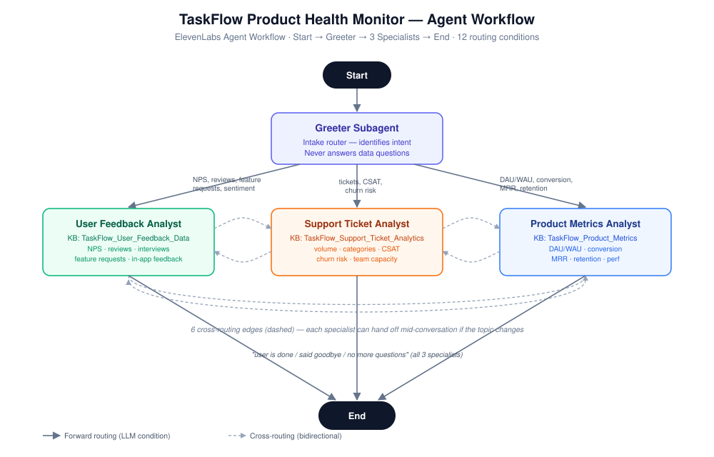

# TaskFlow Product Health Monitor

A multi-agent voice AI system built on ElevenLabs Agents that routes spoken product-health questions to the right specialist — user feedback, support tickets, or product metrics — using workflow orchestration instead of one large prompt.

## Context / Problem

TaskFlow (a project management SaaS, modeled at 9,764 paying customers and $14.88M ARR for this exercise) has product health signals scattered across three domains — user feedback/NPS, support ticket analytics, and product engagement/conversion metrics. A PM or TPM who wants a quick answer ("how's NPS trending?", "which accounts are at churn risk?", "how's the conversion funnel doing?") normally has to know which dashboard or team owns that data and go find it manually.

A single-prompt voice agent could technically hold all three domains' context at once, but that creates two problems in practice: prompt bloat (three domains' worth of instructions and boundaries competing for the same context window) and scope bleed (nothing stops the agent from blending support-ticket churn language into an NPS answer, or vice versa). The brief for this build explicitly called for **workflow orchestration** — routing to scoped specialist agents — rather than a single do-everything prompt.

## Objective

Build a multi-agent ElevenLabs Agent Workflow that:
- Lets a PM ask a product-health question out loud and get routed automatically to the correct specialist
- Keeps each specialist's knowledge strictly scoped to its own domain (no cross-contamination between feedback, tickets, and metrics data)
- Supports natural topic changes mid-conversation (a user asking about NPS should be able to pivot to asking about churn risk without restarting the call)
- Redirects politely, rather than guessing, when a specialist is asked something outside its scope

## Approach & Key Decisions

**Router-only Greeter, not a Greeter-that-also-answers.** The Greeter subagent's prompt explicitly forbids it from answering data questions itself ("DO NOT answer any data questions yourself. Acknowledge the question briefly and let the system route."). The trade-off considered and rejected: letting the Greeter answer simple/obvious questions directly to save a routing hop. That was rejected because it would have created a second place where domain boundaries could blur — every data answer needed to come from exactly one scoped specialist, not from a generalist front door that sometimes also answers.

**One knowledge-base file per specialist, not a shared pool.** Each specialist has `additional_knowledge_base` set to exactly one `.docx` (verified directly in the workflow JSON — see Sample Data below), with `inherit_knowledge_base` left off. The alternative — giving every specialist access to all three files and relying on the prompt alone to enforce scope — was rejected because it depends on the LLM choosing not to look at data it technically has access to. Restricting the KB attachment itself is a harder guarantee than a prompt instruction alone.

**LLM-condition edges over rigid menu/DTMF-style routing.** Routing conditions are natural-language descriptions evaluated by the model (e.g. *"The user is asking about NPS, net promoter score, user feedback, app reviews, app store ratings, user interviews, user sentiment, feature requests, in-app feedback, or what users are saying."*) rather than requiring the caller to say an exact keyword or press a number. This trades a small amount of determinism for a much more natural voice experience — worth it for a conversational interface.

**Bidirectional cross-routing edges instead of forcing a call restart.** Each pair of specialists has both a forward and backward LLM condition on the same edge object, so a user mid-conversation with the Support Ticket Analyst can ask an NPS question and get handed to the User Feedback Analyst without saying goodbye and re-entering the workflow from the Greeter.

## What It Does

1. Caller connects; first message identifies the assistant as the TaskFlow Product Health Monitor and names the three specialist tracks available.
2. The **Greeter Subagent** listens, classifies intent against its routing guide, and hands off — it never answers the question itself.
3. One of three specialists picks up the conversation, scoped to exactly one knowledge base:
   - **User Feedback Analyst** — NPS survey results, app store reviews, user interview insights, in-app feedback, feature request rankings.
   - **Support Ticket Analyst** — ticket volume/trends, category breakdowns, resolution times, CSAT, churn-risk accounts, team capacity.
   - **Product Metrics Analyst** — MRR/ARR, DAU/WAU, conversion funnel, retention cohorts, performance benchmarks, competitive win/loss.
4. If the caller's question drifts into another specialist's territory, a cross-routing edge hands off to the correct specialist directly (no restart).
5. If asked something genuinely outside all three scopes, the active specialist redirects rather than guessing (see Guardrails below).
6. When the caller indicates they're done, any specialist can route to the shared **End** node.

### Guardrails (verified from each specialist's system prompt)

Each specialist's prompt includes an explicit boundary list. For example, the Support Ticket Analyst is instructed: *"Do NOT answer questions about NPS scores, app reviews, or user interview findings. Say: 'That is user feedback data. Want me to redirect you to the feedback analyst?'"* — the same pattern (name the out-of-scope topic, name the correct track, offer to redirect) repeats for all three specialists, verified directly in the workflow JSON's `additional_prompt` fields.

## Architecture / Flow

Nodes: `Start → Greeter Subagent → {User Feedback Analyst | Support Ticket Analyst | Product Metrics Analyst} → End`

Edges (verified by counting `workflow.edges` in the JSON — 9 edge objects beyond the initial Start→Greeter connector):
- **3 forward edges** — Greeter → each specialist, each gated by its own LLM condition
- **3 end edges** — each specialist → End, all sharing the condition *"The user has indicated they are done, said goodbye, thanked the agent, or has no more questions."*
- **3 bidirectional cross-routing edges** — one edge object per specialist pair, each carrying both a forward and a backward LLM condition, for **6 routing conditions total**

3 + 3 + 6 = **12 routing conditions**, matching the build documentation.

## Sample Data

Illustrative, synthetic data taken directly from the shipped knowledge-base files (labeled synthetic in the source documents themselves — generated for this exercise, not real TaskFlow data):

**NPS Survey Responses** (`TaskFlow_User_Feedback_Data.docx`):

| Response ID | Date | Company | Plan Tier | NPS Score | Category |
|---|---|---|---|---|---|
| NPS-1001 | 2026-01-04 | Willowmere Foods | Free | 9 | Promoter |
| NPS-1002 | 2026-01-15 | Aster Biotech | Starter | 7 | Passive |
| NPS-1003 | 2026-01-03 | Pinecrest Studios | Free | 10 | Promoter |

**NPS Monthly Trend** (aggregated, live formulas in the source doc):

| Month | Responses | Promoters | Passives | Detractors | NPS Score |
|---|---|---|---|---|---|
| Jan 2026 | 40 | 22 | 14 | 4 | 45 |
| Feb 2026 | 40 | 22 | 13 | 5 | 43 |
| Mar 2026 | 40 | 23 | 11 | 6 | 42 |

The Support Ticket and Product Metrics knowledge bases follow the same pattern — a monthly rollup table plus a detail/sample table — scoped exclusively to their respective specialist. See `codebase/` for the full files.

## Results / Learnings

- Restricting KB access at the node level (not just via prompt instruction) is the stronger scoping mechanism — worth doing even though it means duplicating some setup effort across three separate subagent configs instead of one shared config.
- Bidirectional edges on a single edge object (rather than two separate one-directional edges) kept the workflow graph readable — 3 objects instead of 6 for the cross-routing layer.
- One thing to watch on a real deployment: the End-node condition phrase is identical across all three specialists ("the user has indicated they are done..."), which is fine functionally but means any future change to that language has to be made in three places rather than one — a natural candidate to extract into a shared variable if ElevenLabs Agent Workflows support that in future.
- This project also became a real-world lesson in backup discipline: an earlier version of this same workflow was lost when the underlying agent's workflow canvas was accidentally cleared, and ElevenLabs' branch/version history only captured a "first publish" checkpoint from before the workflow was built, not the in-progress draft. The `codebase/agent-workflow-config.json` in this folder — captured via "Copy agent JSON config" — is kept specifically so this build has an external, versioned backup independent of the platform's own history.

## Tech Stack

| Component | Value (verified from `agent-workflow-config.json`) |
|---|---|
| Platform | ElevenLabs Agents (Agent Workflows) |
| LLM | Gemini 2.5 Flash |
| ASR | ElevenLabs Scribe (`scribe_realtime`), high quality, PCM 16kHz input |
| TTS | `eleven_flash_v2` |
| Orchestration | ElevenLabs Agent Workflow (visual node/edge graph — `override_agent` subagent nodes, LLM-condition edges) |
| Knowledge base | Per-node scoped `.docx` attachments (RAG disabled, direct KB attach per specialist) |

## How to Run It

1. In ElevenLabs, create a new agent (or open an existing one) and go to **Agent → "..." → Import agent JSON config**.
2. Paste the contents of `codebase/agent-workflow-config.json`. Note the `access_info.creator_name` / `creator_email` fields are redacted in this copy — ElevenLabs assigns fresh identity/ownership metadata on import, so this does not block the import.
3. Under **Knowledge Base**, upload the three `.docx` files from `codebase/` if they aren't already attached after import, and confirm each specialist node's `additional_knowledge_base` points to its one correct file.
4. Use **Preview** to test both voice and chat mode; try a topic-switch mid-conversation (e.g. ask an NPS question, then ask about churn risk) to confirm cross-routing works.
5. **Publish** when satisfied — and consider re-running "Copy agent JSON config" periodically as your own external backup, since Agent Workflow version history only captures published snapshots, not draft-in-progress states.
