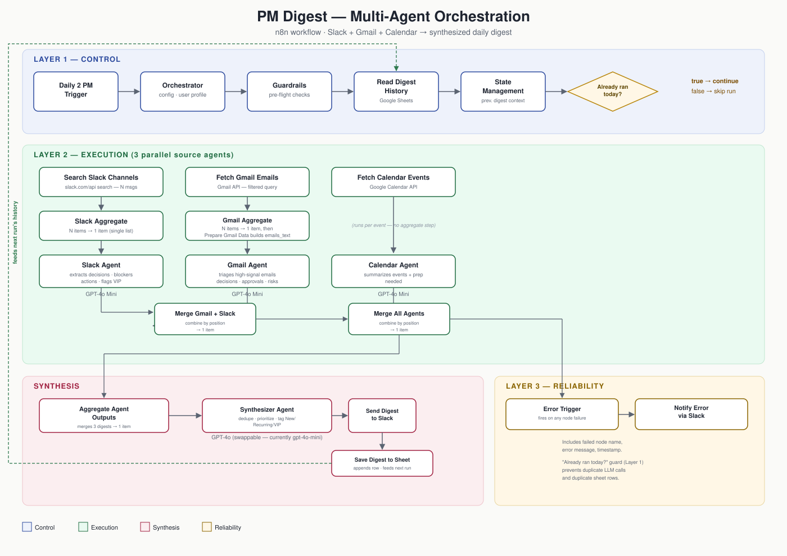

# PM Digest — Multi-Agent Orchestration (Slack + Gmail + Calendar)

A multi-agent n8n workflow that pulls a Program Manager's day from three separate sources — Slack, Gmail, and Google Calendar — routes each source through its own specialized AI agent, and synthesizes everything into one prioritized, deduplicated daily digest posted to Slack and logged to Google Sheets.

## Context / Problem

A Program Manager's actual workload — decisions to make, deadlines to track, blockers to unblock, people to follow up with — is scattered across three tools that don't talk to each other. Checking each one separately every morning is slow, and it's easy to miss something that shows up in one channel but not another (a deadline mentioned in email that's also the subject of a Slack thread, for instance). A single-agent chatbot that answers one question at a time doesn't solve this — what's needed is something that ingests from multiple sources at once, understands each source's context, and reconciles them into one picture.

## Objective

Design and build a multi-agent orchestration pipeline that:
- Ingests from three distinct sources (Slack, Gmail, Calendar) in parallel
- Routes each source through a dedicated agent with a focused prompt and a clear input/output contract
- Merges and synthesizes all three outputs into a single, prioritized, deduplicated digest — tagging what's new vs. recurring, and escalating anything involving a VIP contact
- Delivers the result automatically, on a schedule, without manual intervention
- Fails gracefully — a broken source shouldn't take down the whole run, and a failure should be visible, not silent

## Approach

**Three-layer architecture.** The workflow is deliberately split into a Control layer (Orchestrator, Guardrails, State Management), an Execution layer (three parallel source agents + a Synthesizer), and a Reliability layer (error handling). Every downstream node reads from the Orchestrator's config object rather than having settings duplicated or hardcoded across nodes — one source of truth for which sources are enabled, the user's profile, VIP contacts, and focus areas.

**Trade-off: per-item agent calls vs. batched agent calls.** The first working version ran the Slack and Gmail agents once per incoming item — once per Slack message, once per email. This looked correct at small volumes but broke down in two ways: it produced fragmented, disconnected summaries instead of one coherent picture per source, and it silently multiplied everything downstream — the Merge and Synthesizer nodes ran once per mismatched item pairing, which surfaced as duplicate rows being written to the history sheet on a single execution. The fix was to insert an **Aggregate node** ahead of each multi-item source (Slack, Gmail), collapsing N raw items into a single array before the LLM call, so each source agent runs exactly once per execution and reasons over the full set of messages/emails together. This is also why Slack messages needed custom parsing logic in the agent prompt — Slack's search API returns rich-text messages as a nested `blocks` structure rather than a flat `text` field, so the prompt walks `blocks → elements → elements` to reconstruct readable text.

**Trade-off: idempotency vs. simplicity.** Without a guard, re-running the workflow (or a scheduled trigger firing twice) would append a duplicate digest to the history sheet and re-post to Slack. Rather than solving this after the fact — inspecting output at the end and discarding a duplicate — the guard sits as early as possible in the pipeline, right after `State Management` and before any of the three source agents fire: it compares the last logged date in the history sheet against today's date, and only proceeds down the "run the agents" branch if they differ. This means a same-day duplicate run costs nothing — no Slack search, no Gmail fetch, no LLM calls — rather than burning API calls only to discard the result at the last step.

**Trade-off: model choice per node.** Each of the three source agents runs on `gpt-4o-mini` — fast, low-cost, appropriate for extracting structured facts (decisions, deadlines, blockers) from a single source. The Synthesizer node is deliberately labeled and wired for `gpt-4o`, the more capable model, since its job — deduplicating overlapping items across three sources, resolving conflicts, and prioritizing by urgency — is a harder reasoning task than any single source agent's job. The model on that node is a configurable choice, not fixed: it can be pointed at `gpt-4o-mini` for lower cost during testing/iteration, or `gpt-4o` for production-quality synthesis, without touching any other part of the pipeline.

## What It Does

1. **Trigger** — a daily schedule trigger fires the workflow (2 PM in the reference config).
2. **Orchestrator** — a single Code node holding all downstream config: which sources are enabled, the Slack search query, the Gmail filter query, the output Slack channel, the user's profile (name, role, team, VIP contacts, focus areas). Every other node reads from this one object.
3. **Guardrails** — validates the config before anything runs: flags an unconfigured output channel, a default/unset user profile, or all sources disabled.
4. **Read Digest History → Format History → State Management** — reads the last several rows from the Google Sheets history log and collapses them into a single summary string, which later lets the Synthesizer tell new items from recurring ones.
5. **"Already ran today?" guard** — compares today's date against the most recent entry in the history sheet; if they match, the run stops here (no agents fire, nothing is re-posted or re-logged).
6. **Three parallel source agents:**
   - **Slack Agent** — searches a configured Slack channel for recent messages, aggregates them into one batch, and extracts decisions/deadlines/blockers/actions, flagging anything involving a VIP contact.
   - **Gmail Agent** — fetches emails matching a filtered query (excludes promotions/social/forums, matches on decision/approval/deadline-related subject lines and phrases), aggregates them, and triages for decisions/approvals/deadlines/risks/stakeholder requests.
   - **Calendar Agent** — pulls today's calendar events and summarizes what each meeting is about, when it is, and what prep is needed.
7. **Merge → Aggregate Agent Outputs** — the three agent outputs are combined into one item with three labeled fields (`email_digest`, `slack_digest`, `gcal_digest`), gracefully substituting a "no data available" placeholder for any source that returned nothing.
8. **Synthesizer Agent** — takes all three digests plus the prior-run history summary, deduplicates overlapping items across sources, sorts by urgency, tags each item `[New]` or `[Recurring]`, elevates VIP-linked items, and produces one unified digest in a fixed section format (Top Priorities, Decisions/Approvals, Deadlines, Risks/Blockers, Who to ping today).
9. **Output** — the digest is posted to the configured Slack channel and appended as a new row to the Google Sheets history log, which feeds the next day's `[New]` vs. `[Recurring]` comparison.
10. **Error handling** — a separate Error Trigger branch catches any node failure anywhere in the workflow and posts the failed node's name, the error message, and a timestamp to Slack.

## Architecture / Flow



## Sample Data

Captured output from an actual run, as written to the history sheet (`Digest` column), with Slack channel formatting left as-is:

```
:fire: Top Priorities (max 3)
- [VIP] Review and approve the final requirements document for the Payments API
  release by tomorrow, July 19, 2026, 5:00 PM. [Email]
- Prepare for the meeting on vendor escalation regarding the UPI Sandbox outage
  today, August 18, 2026, from 4:00 PM to 5:00 PM. [Calendar]
- [New] Contribute updates related to n8n testing in the 1:1 Stakeholder
  Alignment Check-in today, August 18, 2026, from 1:00 PM to 2:00 PM. [Calendar]

:white_check_mark: Decisions / Approvals
- [VIP] Approve or revise the proposed Payments API release timeline and scope. [Email]

:alarm_clock: Deadlines
- [VIP] Review and approve requirements doc by Sunday, July 19, 2026, 5:00 PM.
  Release scheduled for Monday, July 20, 2026. [Calendar]
- [New] Prepare necessary updates or materials for the Stakeholder Alignment
  Check-in on August 25, 2026. [Calendar]

:construction: Risks / Blockers
- [New] UPI integration is blocked pending vendor credentials. [Calendar]
- [VIP] Delay in reviewing the Payments API timeline could lead to release
  slip and misalignment. [Email]

:busts_in_silhouette: Who to ping today
- [New] Follow up with vendor regarding credentials and clarify the deadline. [Calendar]
- [VIP] Ask QA and engineering for sign-off on the Monday release. [Calendar]
```

This example shows the Synthesizer's core value: the "UPI Sandbox" blocker mentioned on Calendar, the Payments API deadline from Email, and the VIP-linked stakeholder check-in are all pulled into one prioritized list with source attribution — instead of three separate places to look.

## Results / Learnings

- **What held up:** the three-layer control/execution/reliability split made debugging tractable — when the digest came out wrong, it was always possible to isolate which layer was at fault (config vs. a single agent vs. the merge/synthesis step) rather than treating the whole pipeline as one black box.
- **What broke, and why it mattered:** the biggest issue by far wasn't the AI reasoning — it was item-count mismatches between parallel branches. n8n runs a node once per incoming item by default; without an explicit aggregation step before each multi-item source, "3 emails + 1 Slack summary" silently became "3 executions of everything downstream," which is a much easier bug to introduce than it is to notice, since each individual node still reports "success." The fix (Aggregate nodes + Combine-by-Position merges + an early idempotency guard) is a pattern worth carrying into any future n8n workflow that fans out over search/list results.
- **What I'd change next:** the Calendar branch still runs its agent once per event rather than being aggregated like Slack and Gmail — it works today because calendar volume is low, but the same fan-out risk exists there and would resurface on a busier calendar day.
- **Where this stops short of production:** per the assignment's own design note, queueing (Redis/SQS-style ordered execution), per-agent execution isolation, and persistent vector-store memory are not implemented — the schedule trigger simulates queueing, and n8n's node-level isolation handles basic separation, but a production deployment would add all three.

## Tech Stack

| Component | Choice |
|---|---|
| Orchestration platform | n8n (self-hosted / n8n.cloud) |
| LLM — source agents (Slack, Gmail, Calendar) | OpenAI `gpt-4o-mini` |
| LLM — Synthesizer | OpenAI (node labeled/wired for `gpt-4o`; swappable per cost/quality trade-off) |
| Agent framework | `@n8n/n8n-nodes-langchain` (LangChain agent nodes) |
| Sources | Slack Web API (search.messages), Gmail API, Google Calendar API |
| State / history store | Google Sheets |
| Output | Slack (channel post) |
| Error handling | n8n Error Trigger → Slack notification |

## How to Run It

1. Import `codebase/05-pmgovernance-multiagent-slackmailcalendar.json` into an n8n instance (self-hosted or n8n.cloud).
2. Connect credentials for Slack (OAuth2, with `search:read` user-token scope for message search), Gmail (OAuth2), Google Calendar (OAuth2), Google Sheets (OAuth2), and OpenAI.
3. Open the **Orchestrator** node and update `slackQuery`'s channel, `calendarEmail`, `outputChannelId`, and `userProfile` to match your own workspace and role.
4. Point **Read Digest History** and **Save Digest to Sheet** at your own Google Sheet (or use `codebase/PM_Digest_History.xlsx` as a starting template — columns are `Date` and `Digest`).
5. Activate the schedule trigger, or run manually via "Execute Workflow" to test.

See `docs/Project-Screenshots.docx` for a node-by-node walkthrough with sample inputs/outputs at each step.
