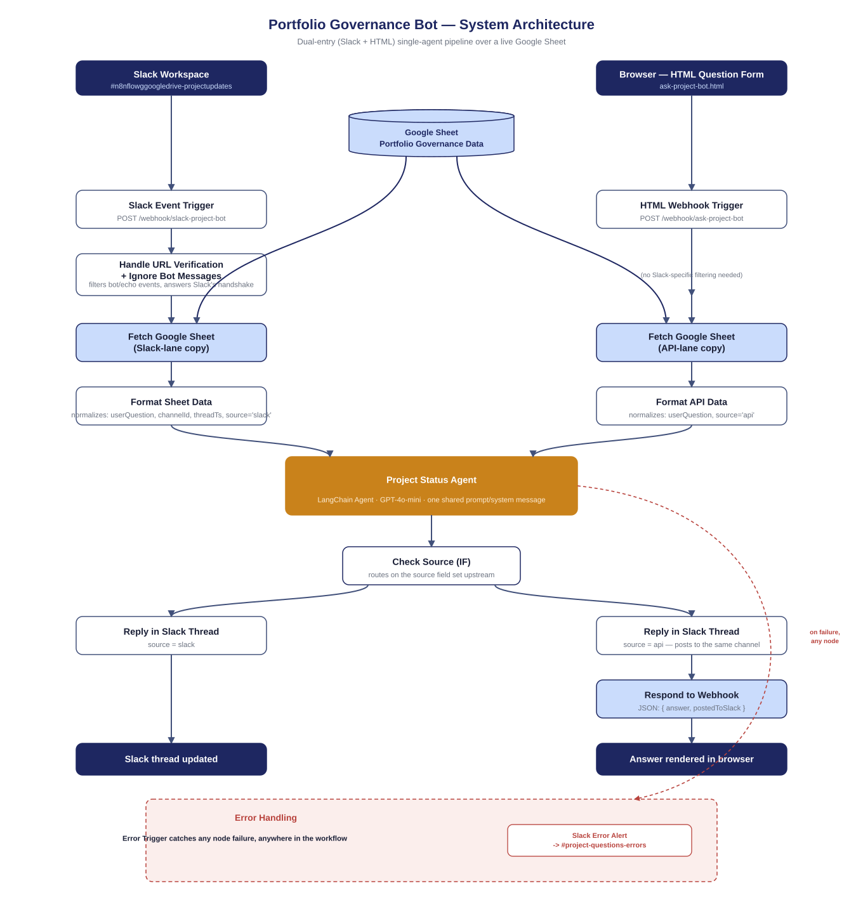

# Portfolio Governance Bot

A dual-entry (Slack + HTML) chatbot that answers natural-language portfolio-status questions — including risk, timeline slippage, governance level, and open defects — against a live Google Sheet, using a single LLM agent.

## Context / Problem

Portfolio and program managers spend a disproportionate amount of time manually re-reading a tracker to answer the same handful of questions over and over: *what's at risk, what's slipped, what needs governance attention, what's blocked and why.* That information already exists in a structured sheet — the bottleneck is retrieval and synthesis, not data collection.

This project builds a portfolio-governance pipeline: pulling project data from a live Google Sheet, reasoning over it with an AI agent, and answering on demand from either Slack or a standalone web form — so retrieval and synthesis stop being manual work. See `docs/Problem-Statement.docx` for the full framing.

## Objective

Build a working chatbot that a portfolio manager can query from **either** Slack or a standalone web form, get consistent, governance-aware answers from the same underlying data and the same agent, and have those answers land back wherever the question came from (a Slack thread, or the browser).

## Approach

- **n8n (low-code workflow engine) over a custom-coded backend.** Faster to iterate on visually, and the trade-off is real: node-level UI bugs (a stray `}}` in a condition, a misnamed duplicate response node, a webhook's Respond setting silently defaulting to "Immediately") turned out to be harder to catch than a type error in a compiled language would have been. That trade-off is documented honestly in Results/Learnings below, not glossed over.
- **Two fully parallel ingestion lanes, not one merged lane.** The Slack-triggered path and the HTML-triggered path each get their own `Fetch Google Sheet` and `Format ... Data` node instances, converging only at the shared AI Agent. Early on this was a single shared node fanning out to both formatters — that broke, because n8n has no way to know which trigger actually fired once the graph merges, so a node referencing "Webhook-HTTPQuestionTrigger" would throw on a pure-Slack run. Duplicating the nodes costs a small amount of redundancy in exchange for real execution isolation.
- **One shared Agent and system prompt, not two.** Both lanes normalize into the same shape (`userQuestion`, `source`, `sheetData`) so a single `gpt-4o-mini` LangChain Agent node can serve both surfaces consistently, whichever one the question came from.
- **gpt-4o-mini, not a larger model.** Answering bounded, structured Q&A over a spreadsheet doesn't need a frontier model; cost and latency mattered more here, and the team already held an OpenAI license.
- **No authentication on either webhook — an explicit, acknowledged trade-off, not an oversight.** Both the Slack Events endpoint and the HTML-form endpoint are open. This was fine for a scoped demo; it is called out plainly in Results/Learnings as the first thing to fix before this goes anywhere near production traffic.

## What It Does

- Listens for two independent triggers: a **Slack Events API** webhook (real messages posted in a Slack channel) and a **standalone HTML form** webhook (a static page anyone can open locally).
- On the Slack side, first handles Slack's one-time URL-verification handshake, then filters out bot/echo messages so the bot never replies to itself.
- Fetches the current state of a **live Google Sheet** — a 46-row governance-tracker export covering 7 programs, each broken into Epic + Sub-task rows, with baseline vs. current due dates, computed schedule slippage, RAG status, rollup % complete, governance tier, and known issues/severity.
- Normalizes whichever input arrived into one common shape and hands it to a single **LangChain Agent** (`gpt-4o-mini`) with a system prompt constraining it to answer only from the sheet data provided, in Slack-flavored markdown, under 400 words.
- Routes the agent's answer based on where the question came from: Slack-originated questions reply in the original thread; HTML-originated questions **both** post to the same Slack channel **and** return a JSON response the browser renders directly.
- A workflow-level Error Trigger catches any node failure and posts an alert to a separate `#project-questions-errors` Slack channel.

### Sample Interactions

These are real, captured outputs from the running workflow (not invented for this write-up):

> **Q:** *"pls share the high risk projects and state why?"*
> **A:** *High Risk Projects:*
> • **Mobile App Launch** — Owner: James Rivera · Status: At Risk · Priority: High · Due: 2026-03-30 — Reason: critical bugs found during QA, under investigation.
> • **new POC Project** — Owner: Srividya P · Status: At Risk · Priority: Medium · Due: 2026-03-01 — Reason: scope creep affecting progress.

> **Q:** *"Which projects are running in July? however any severity required against them and highlight any dependencies."*
> **A:** *"Currently, there are no projects listed that are running in July."*
> — a genuine negative-result case: the agent correctly reports nothing matched rather than inventing a project.

> **Q:** *"Show which projects crossed their baseline .. mention their start and end dates. Mention the risks associated and anything specific to review for Governance against these projects.."*
> **A:** *Projects that crossed their baseline dates:*
> • **Reels Ranking Overhaul** — Start: 2026-01-05 · Baseline: 2026-08-31 · Current Due: 2026-09-30 · Days Slipped: 30 — At Risk; escalation needed for infra scaling fix. Governance: Steering Committee Review.
> • **Llama Enterprise API Platform** — Start: 2026-01-12 · Baseline: 2026-10-15 · Current Due: 2026-11-30 · Days Slipped: 46 — At Risk; GPU capacity confirmation needed. Governance: Steering Committee Review, contingency plan needed.
> • **Unified Messaging Backend** — Start: 2026-02-02 · Baseline: 2026-09-01 · Current Due: 2026-10-16 · Days Slipped: 45 — Blocked; compliance review delaying progress.
> *(response continues with additional matching projects)*

## Architecture / Flow

Both entry points converge on the same Google Sheet and the same AI Agent; only the pre-processing (Slack-specific filtering) and the final response step (Slack reply vs. JSON + Slack reply) differ per lane. Error handling sits outside the main flow as a workflow-wide catch, not a per-node check.

## Sample Data

A real row from the underlying Google Sheet (`ProjectUpdates-GoogleSheet.xlsx`, `Portfolio` sheet), showing the governance columns the agent reasons over:

| Field | Value |
|---|---|
| Issue Key | `META-RRO-0` |
| Issue Type | Epic |
| Project Name | Reels Ranking Overhaul |
| Status | At Risk |
| Baseline Due Date | 2026-08-31 |
| Due Date (Current) | 2026-09-30 |
| Days Slipped | 30 *(formula: Due − Baseline)* |
| RAG Status | Red *(formula, derived from Status + Days Slipped)* |
| % Complete | 81% *(formula: average of this Epic's own Sub-tasks)* |
| Governance Level | Steering Committee Review |
| Known Issues / Bugs | 1 critical/high severity issue(s) open across sub-tasks *(formula rollup)* |

`Days Slipped`, the Epic-level `% Complete`, and the Epic-level `Known Issues / Bugs` / `Issue Severity` are all live spreadsheet formulas, not hand-entered — editing any Sub-task row recalculates its parent Epic automatically.

## Results / Learnings

What held up:
- The dual-entry, single-agent architecture worked as designed once wired correctly — one prompt, one model, two front doors, consistent answers either way.
- Formula-driven rollups in the source sheet (RAG status, days slipped, % complete) meant the agent's governance answers stayed accurate without any hand-maintained summary fields.

What I'd do differently, in order of how much time each one actually cost:
1. **A webhook's "Respond" setting defaulting to "Immediately" will silently override a correctly-built downstream response node.** This was the single largest source of debugging time — the fix was one dropdown, but confirming *that* was the cause took far longer than it should have.
2. **A single HTTP request can only get one response.** A duplicated node, misleadingly named `Respond to Slack1` but actually a second `Respond to Webhook` node with an empty body, sat earlier in the chain than the real response node and silently won the race every time. Node *names* in a low-code tool are not proof of node *type* — always verify the parameter panel, not the label.
3. **Building a JSON response as a string template breaks on any multiline or quote-containing content.** An LLM's markdown-formatted answer has real newlines; substituting it into a hand-written `{ "answer": "..." }` string corrupts the JSON. The fix is to let the platform serialize a real object expression instead of hand-templating a string.
4. **Copy-pasted expressions are fragile.** A stray trailing `}}` in an IF condition (`{{ $json.source }} }}`) silently broke source-based routing without throwing an error — it just always evaluated to the same branch. Worth a habit of re-reading expression fields character-by-character after any manual edit.
5. **No authentication on a public-facing webhook is an easy trade-off to make during a demo and an easy one to forget to revisit.** Documented here explicitly so it isn't quietly carried into anything closer to production.

## Tech Stack

| Component | Technology | Verified version |
|---|---|---|
| Workflow engine | n8n Cloud | — |
| Webhook triggers | `n8n-nodes-base.webhook` | v2 / v2.1 |
| Conditional routing | `n8n-nodes-base.if` | v2 / v2.3 |
| Input normalization | `n8n-nodes-base.code` (JavaScript) | v2 |
| AI Agent | `@n8n/n8n-nodes-langchain.agent` | v1 |
| LLM | OpenAI `gpt-4o-mini` via `@n8n/n8n-nodes-langchain.lmChatOpenAi` | v1.3 |
| Data source | Google Sheets via `n8n-nodes-base.googleSheets` | v4 |
| Chat integration | Slack Events API (inbound) + Slack Web API (outbound) via `n8n-nodes-base.slack` | v2 |
| Response handling | `n8n-nodes-base.respondToWebhook` | v1 / v1.5 |
| Error handling | `n8n-nodes-base.errorTrigger` | v1 |
| Frontend | Static HTML + vanilla JavaScript (`fetch`), no framework | — |

Every version above is read directly from the `typeVersion` field of the shipped `codebase/workflow.json`, not assumed.

## How to Run It

1. **Import the workflow**: in n8n, Workflows → Import from File → `codebase/workflow.json`.
2. **Connect credentials**: attach your own Slack API and Google Sheets credentials to the relevant nodes (this repo ships the workflow logic, not live credentials — n8n never exports actual key material, only credential references).
3. **Point the Google Sheets nodes** (`Fetch Google Sheet-Slack`, `Fetch Google Sheet-API`) at your own copy of `codebase/ProjectUpdates-GoogleSheet.xlsx` (imported into Google Sheets).
4. **Slack setup**: create a Slack app, enable Event Subscriptions pointed at the workflow's production webhook URL, subscribe to `message.channels`, and invite the bot to your target channel. (Full click-by-click steps, including the OAuth scopes and Event Subscriptions screens, are in the setup walkthrough that informed this build.)
5. **Activate the workflow**, then open `codebase/ask-project-bot.html` directly in a browser (no server needed) and update the `Webhook URL` field to your own production URL.
6. Ask a question either in the Slack channel or the HTML form — both should return an answer and post to the configured Slack channel.
